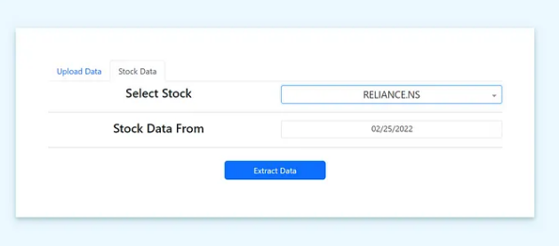
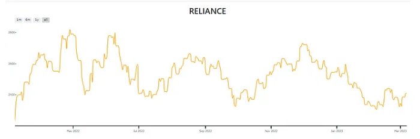
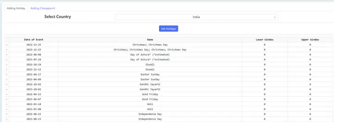
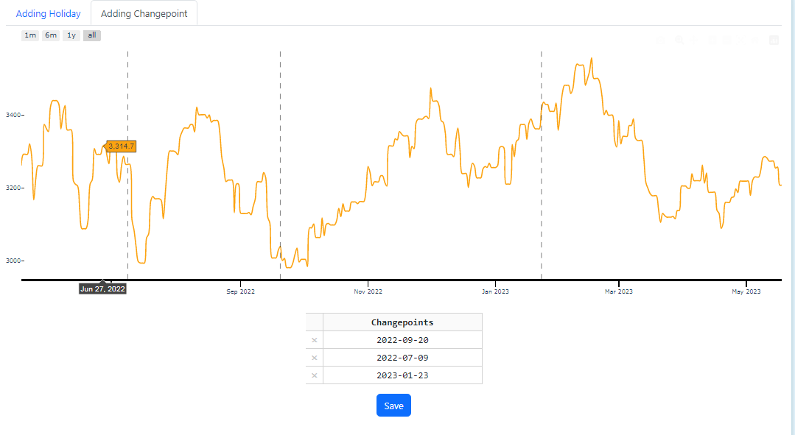

# FB Prophet Playground

## Table of contents
* [Introduction](#introduction)
* [Usage](#usage)

## Introduction
 FB Prophet Playground is a handy automation tool that leverages Facebook Prophet for accurate and efficient forecasting. With this tool, you have the convenience of uploading your own data or utilizing stock data to generate insightful forecasts with ease. Instantaneously, you can witness the results and fine-tune various parameters to refine your predictions further. Additionally, the tool allows for the inclusion of holiday variables, enabling more precise and directionally correct forecasts. Whether you're a novice or an experienced practitioner, this Forecasting Automation using Facebook Prophet is designed to simplify the process and empower you to make informed decisions based on reliable forecasts.

Medium Post [link](https://abhinavk910.medium.com/fb-prophet-playground-15286a9f141e)

Playground [link](https://time-series-forecasting.onrender.com/)

## Usage

* Step 1 - Upload Data
There are Two options, Either you can upload your data or can choose Stock and it will extract your data from Yahoo Finance API.

* Step 2 - Adding Features
** Adding Holidays
Holidays in a Prophet model can significantly improve the accuracy of the forecasts, especially if there are significant seasonal variations in the data.

** Adding Changepoints
SomeTimes Manually adding changepoints help increase the accuracy of the forecasts.

* Step 3 - Forecasting Playground
 
[step3 playground](assets/head6.PNG)

Have all the tools to tune Prophet Model. You can also plot components.

[step3 components](assets/head7.PNG)

